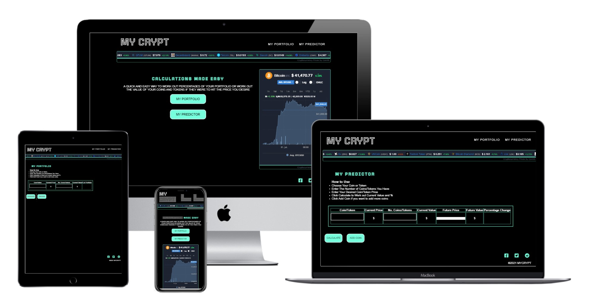
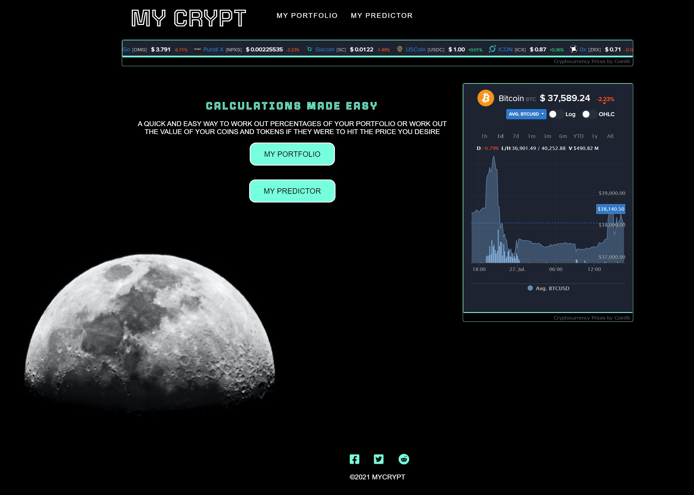
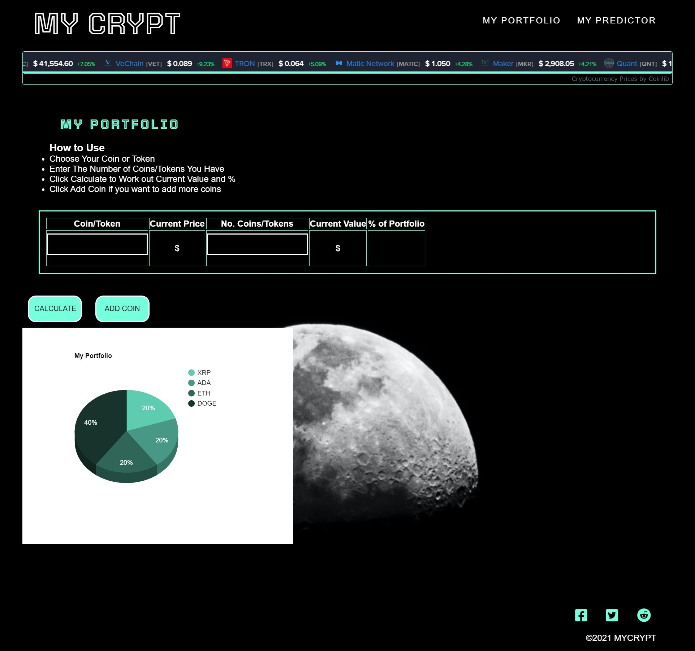
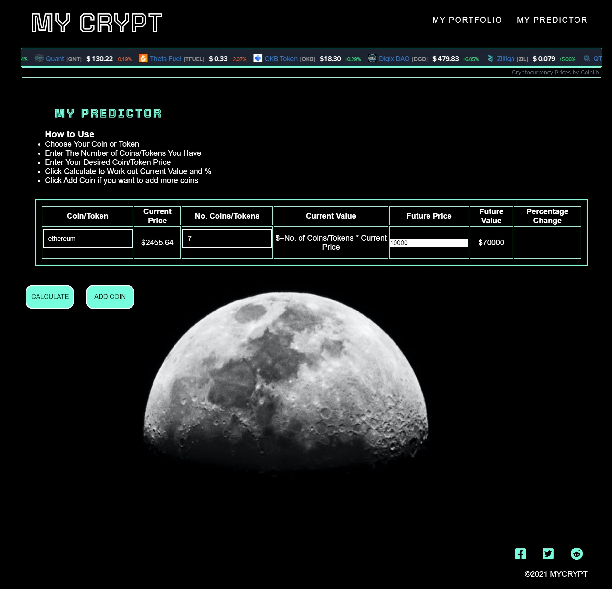

# MYCRYPT

MYCRYPT is a site that will be used for people to preform calculations  regarding their Cryptocurrency coins and tokens allowing them to forecast furture values and potential portfolio percentages.

## User Stories
A user would come to the website if they wished to estimate their future position based on poissble price increase/decrease in their chosen cyrptocurrency coins and tokens. They would click the My predictor page, simply chose their desired cryto the website will then bring up the current price. They will then be able to imput their estimated future price, the webiste will then calcualte the value of their tokens based on the new price and indicate the prercentage change in this. This will allow the user to see differenct scenario prices and help them decide entry and exit levels into the market.

A user would come to the website if they wanted to evaluate their current portfolio. They would click the my portfolio page, they would then chose their desired cyrptocurrency coins and tokens he website will then bring up the current price. They can then imput their number of coins and it will calculate the value and the percentage of their portfolio that the coin occupies. They can continue to add different coins using the add coin button. This will allow them to make decisions on if they believe certain coins account for too much of their portfolio and if they wish to buy and sell any if so.

## Features 

- __Navigation Bar__

  - Featured on all three pages, the full responsive navigation bar includes links to the Landing/Home page via the logo, My Portfolio and My Predictor Page which is identical in each page to allow for easy navigation.
  - This section will allow the user to easily navigate from page to page across all devices without having to revert back to the previous page via the ‘back’ button. 

- __The landing page image__

  - The landing page will contain a short tag line followed by two navigation buttons to take the user to the functional pages. 
  - There will also we a widget at the top of the page and all pages, which is a scrolling current price list of cryptocurrencies which is from [CoinLib](https://coinlib.io/widgets?w_chart_coin_id=859&w_chart_pref_coin_id=1505&w_all_theme=Dark#w_chart). This has then been styled to match the scheme of the website.
  - Another widget has also been included on this page showing the corrunt price and trend information also from [CoinLib](https://coinlib.io/widgets?w_chart_coin_id=859&w_chart_pref_coin_id=1505&w_all_theme=Dark#w_chart)

- __The Footer__ 

  - The footer section includes links to the relevant social media sites for Museum View. The links will open to a new tab to allow easy navigation for the user. 
  - The footer is valuable to the user as it encourages them to keep connected via social media.
  -The footer also includes some standard copyright text

- __MY PORTFOLIO__

  - The My Portfolio page will first have a brief text paragrpagh using an unordered list to show how to use this feature.
  
  - There will then be a table where the user can select a coin/token from a drop down iput list, which will then display the current price of the coin which is done using an API from [Coingecko](https://www.coingecko.com/api/documentations/v3)
  - The user then can enter the number of tokens they own/wish to own usign an input box.
  - The user will then click the calculate button which should use a function to calculate the current value of that coin and the percentage of that portfolio it makes up.
  - The user will also be able to click the add coin button if they wish to add more rows to the table.
  - The calculate button will also then create a pie chart from [Google Charts](https://developers.google.com/chart) to help display this information.

- __MY PREDICTOR__

  - The My Predictor page will first have a brief text paragrpagh using an unordered list to show how to use this feature.
  - The user then can enter the number of tokens they own/wish to own usign an input box.
  - The user will then click the calculate button which should use a function to calculate the current value of that coin.
  - the user will also have the option to iput a desired future price, the button will also calculate the future value based on their current number of tokens and the futue price.
  - There is also a function which will calculate the percentage change from the current value to the future value.
  - The user will also be able to click the add coin button if they wish to add more rows to the table.

## Features Left to Implement

- The website could also evolve to allow user to create an account to store their portfolios and see up to date information.

- add validation to choice of currency alert if not found 
- add a delete row button 

## Testing 
Please see wireframe-images folder within the images folder for images of wireframes completed at the start of the project.
Please see [testing.md](/testing.md) for Testing

## Deployment

This section should describe the process you went through to deploy the project to a hosting platform (e.g. GitHub) 

- The site was deployed to GitHub pages. The steps to deploy are as follows: 
  - In the GitHub repository, navigate to the Settings tab 
  - From the source section drop-down menu, select the Master Branch
  - Once the master branch has been selected, the page will be automatically refreshed with a detailed ribbon display to indicate the successful deployment. 

The live link can be found here - https://alexxjamess.github.io/mycrypt/

## Credits 

### Content 

- The icons in the footer for social media were taken from [Font Awesome](https://fontawesome.com/)

- The calculate and Add button were created use ideas from [W3Schools](https://www.w3schools.com/css/css3_buttons.asp)

### Media

- The photo used on the background were from [Pexels](https://www.pexels.com/photo/half-moon-596132/) 

- The Embedded Bitcoin Live Chart from [CoinLib](https://coinlib.io/widgets?w_chart_coin_id=859&w_chart_pref_coin_id=1505&w_all_theme=Dark#w_chart)

- The  Embedded Live rolling price Chart from [CoinLib](https://coinlib.io/widgets?w_chart_coin_id=859&w_chart_pref_coin_id=1505&w_all_theme=Dark#w_chart)

- The charts are from [Google Charts](https://developers.google.com/chart)

