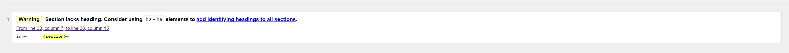
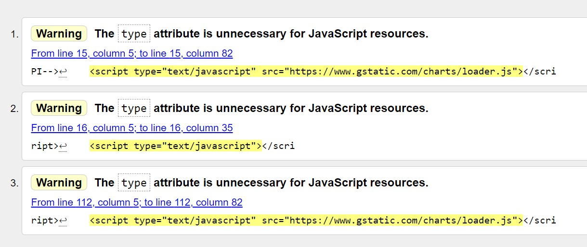

# Testing

I have tested both HTML, CSS and Javascript for all pages and shown the results below.

## Features Testing 
### Index
#### Navigation Bar
- My predictor and My Portfolio Page all work correctly taking user to correct page without opening a new window.
#### Logo
- Image when clicked works correctly taking user to home/index page.
#### Embedded Widgets
-

#### Navigation Buttons Home Page 
- My Predcitor and My Portfolio Buttons Works correctly taking user to explore page without opening a new window.
- My Predcitor and My Portfolio Buttons shade when hovering over as expected.
- My Predcitor and My Portfolio Buttons Gives animation of Depressing once clicked as expexted.
#### Social Media Buttons 
- Facebook Icon takes user to facebook home page in new window as expected as MYCRYPT facebook account not active. 
- Reddit Icon takes user to Reddit home page in new window as expected as MYCRYPT view Reddit account not active. 
- Twitter Icon takes user to Twitter home page in new window as expected as MYCRYPT Twitter account not active. 
### MY Portfolio
#### Navigation Bar
- My predictor and My Portfolio Page Links all work correctly taking user to correct page without opening a new window.
#### Logo
- Image when clicked works correctly taking user to home/index page.
#### Table
- Links to architectual drawings opens dropbox link in new window as expected
- link to register page opens page without opening new window as expected 
#### Embedded Rolling Price Bar 
- Video Plays while embedded once clicked and starts from 1:00 minute mark as expected
- Video opens in new window once clicked on youtube logo or title as expcted
#### Calculate Button 
-
#### Add Coin Button 
- 
#### Social Media Buttons 
- Facebook Icon takes user to facebook home page in new window as expected as MYCRYPT facebook account not active. 
- Reddit Icon takes user to Reddit home page in new window as expected as MYCRYPT view Reddit account not active. 
- Twitter Icon takes user to Twitter home page in new window as expected as MYCRYPT Twitter account not active. 
### My Predicotr
#### Navigation Bar
-  My predictor and My Portfolio Page Links all work correctly taking user to correct page without opening a new window.
#### Logo
- Image when clicked works correctly taking user to home/index page.
#### Carousel 
- Buttons to go to next and previous slides work as expected
- Tabs to pick an image work as expected 
- All images are shown 
- All captions are shown 
#### Social Media Buttons 
- Facebook Icon takes user to facebook home page in new window as expected as MYCRYPT facebook account not active. 
- Reddit Icon takes user to Reddit home page in new window as expected as MYCRYPT view Reddit account not active. 
- Twitter Icon takes user to Twitter home page in new window as expected as MYCRYPT Twitter account not active. 

## Validator Testing 

### HTML - Index
  - After running through [W3C validator](vl). The index page had several errors regarding the widgets and iframes as a lot of the stlying was included in the HTML, this has been taken out and styled in CSS.
  -The other error shown relates to a section not containg any identifying heading, this section just containted the embedded iframe. To resolve this I removed the section and placed the iframe in a div only.

### HTML - My Portfolio
 - After running through [W3C validator](https://validator.w3.org/l). The following errors were shown . 
  
  - 
  
### HTML - My Predictor 
  After running through [W3C validator](https://validator.w3.org/).There were no errors found.

### CSS - 
  - Only one error was found when running me style.css through the validator [(Jigsaw) validator](https://jigsaw.w3.org/css-validator/validator) This error was caused due to typing being entered in the code rather than the terminal. This had now been removed completely as this code was not needed.

### Responsiveness 
- Using Google Dev Tools to test the website or a range of devices using the ipad and pixel2 as the main marker i was able to get most items responsives, to tidy up any elements I then used some media queries based on two different screen widths to fix any other issues.

### Unfixed Bugs
- There is still a bug on the register page where the bullet points on the benefits section just show a standard bullet point and not an image of the museum. I have been unable to fix this issue. The bullet points did work but stopped unexpectedly

