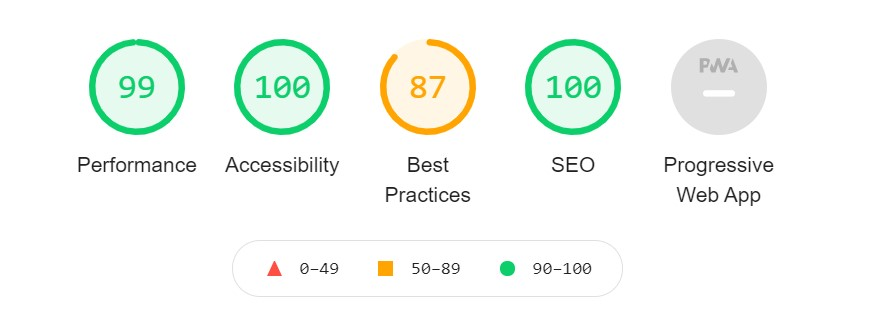
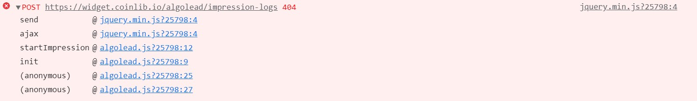
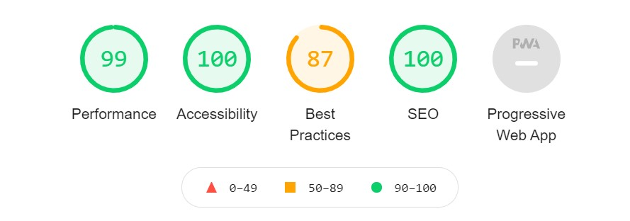
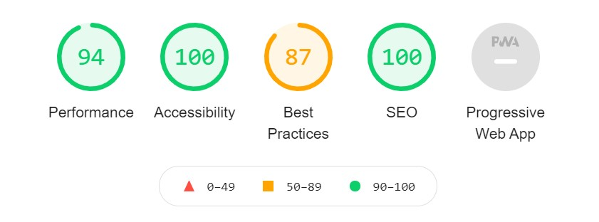
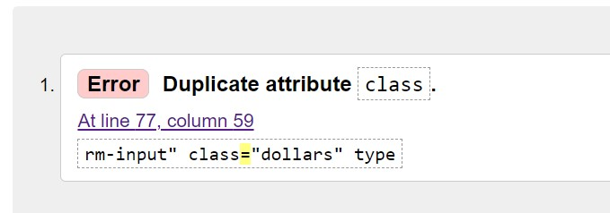

# Testing

I have tested both HTML, CSS and Javascript for all pages and shown the results below.

## Features Testing 
### Index
#### Navigation Bar
- My predictor and My Portfolio Page all work correctly taking user to correct page without opening a new window.
#### Logo
- Image when clicked works correctly taking user to home/index page.
#### Embedded Widgets
- rolling widget works as expected, continously rolls across, pauses when hovered over. Opens in new tap when clicked on coin.
- bitcoin price chart works as expected can be interacted on the index page. However when clicking on Bitcoin logo page is opened in the same tab, even when applying "target=_blank"
#### Navigation Buttons Home Page 
- My Predcitor and My Portfolio Buttons Works correctly taking user to explore page without opening a new window.
- My Predcitor and My Portfolio Buttons shade when hovering over as expected.
- My Predcitor and My Portfolio Buttons Gives animation of Depressing once clicked as expexted.
#### Social Media Buttons 
- Facebook Icon takes user to facebook home page in new window as expected as MYCRYPT facebook account not active. 
- Reddit Icon takes user to Reddit home page in new window as expected as MYCRYPT view Reddit account not active. 
- Twitter Icon takes user to Twitter home page in new window as expected as MYCRYPT Twitter account not active. 
#### Lighthouse Test
- As you can see from the image below this page scored highly on all aspect except best practices this is due to an error being shown in the console log from the API (CoinGecko). The API still works but returns 404 error also shown below.

### MY Portfolio
#### Navigation Bar
- My predictor and My Portfolio Page Links all work correctly taking user to correct page without opening a new window.
#### Logo
- Image when clicked works correctly taking user to home/index page.

#### Embedded Rolling Price Bar 
- rolling widget works as expected, continously rolls across, pauses when hovered over. Opens in new tap when clicked on coin.
#### Portfolio Table
- Row 1 Cell 0 Field contains input of datalist with drop down for selection the user can also enter in values - validation is needed to inform the user if the value they have entered is not valid.
- Row 1 Cell 1 Field contains a '$' created using a before content in css, this shows in all rows for this cell. The value in then created using an API function which is working correctly.
- Row 1 Cell 2 Field contains a number input for the user to enter their number of coins. The user is allowed to enter decimal places as they may not own full values of some coins- however it is validated so they are unable to enter a negative number this works correctly.
- Row 1 Cell 3 Field contains $ as Cell 1. The figure is entered into the cell when clicking calculate by multiplying cell 1 (current price) and cell 3 (coins/token). This function is working correctly.
- Row 1 Cell 4 Field contains % using css. it also contains a result from a function to calculate precentage portfolio this is working correctly- However when a new row is added and figures are not entered this disrupts the function and returns a NaN. The calculate button also needs to be entered twice if new information needs updating.
- Each new from containts the same information and is working correctly 
#### Calculate Button 
-the calculate button works correctly, running two functions 
  - Calculate Total Current Value in each row - this function works correctly 
  - Calulate Porfolio Percentage in each row - this function works correctly.
#### Add Coin Button 
- Add coin button works, creating a new row on each click. works correctly
- When clicked the rows includes input data, classes and IDs as requried. works correctly
#### Social Media Buttons 
- Facebook Icon takes user to facebook home page in new window as expected as MYCRYPT facebook account not active. 
- Reddit Icon takes user to Reddit home page in new window as expected as MYCRYPT view Reddit account not active. 
- Twitter Icon takes user to Twitter home page in new window as expected as MYCRYPT Twitter account not active. 

#### Lighthouse Test
- As you can see from the image below this page scored highly on all aspect except best practices this is due to an error being shown in the console log from the API (CoinGecko). The API still works but returns 404 error also shown below.

### My Predicotr
#### Navigation Bar
-  My predictor and My Portfolio Page Links all work correctly taking user to correct page without opening a new window.
#### Logo
- Image when clicked works correctly taking user to home/index page.
#### Portfolio Table
- Row 1 Cell 0 Field contains input of datalist with drop down for selection the user can also enter in values - validation is needed to inform the user if the value they have entered is not valid.
- Row 1 Cell 1 Field contains a '$' created using a before content in css, this shows in all rows for this cell. The value in then created using an API function which is working correctly.
- Row 1 Cell 2 Field contains a number input for the user to enter their number of coins. The user is allowed to enter decimal places as they may not own full values of some coins- however it is validated so they are unable to enter a negative number this works correctly.
- Row 1 Cell 3 Field contains $ as Cell 1. The figure is entered into the cell when clicking calculate by multiplying cell 1 (current price) and cell 3 (coins/token). This function is working correctly.
- Row 1 Cell 4 Field contains $ as Cell 1. There is also a input box for the user to input their desired future price The user is allowed to enter decimal places as they may not own full values of some coins- however it is validated so they are unable to enter a negative number this works. This is currently working 
- Row 1 Cell 5 Field contains $ as Cell 1. The figure is created by a function which is run when clicking calculate the function muitiplys cell 2 and cell 4. This is curently working 
- Row 1 Cell 6 Field contais % using css. The function created is run when clicking the calculate button. The function works by subtracting cell 5 by cell 3 then diving it by  cell 3 and multiplying it by 100. The is currently working.
- Each new from containts the same information and is working correctly 
#### Calculate Button 
- the calculate button works correctly, running three functions 
  - Calculate Total Current Value in each row - this function works correctly 
  - Calculate Future Value in each row- This function works correctly 
  - Calulate Percentage Change in each row - this function works correctly.
#### Add Coin Button 
- Add coin button works, creating a new row on each click. workas correctly
- When clicked the rows includes input data, classes and IDs as requried. works correctly 
#### Social Media Buttons 
- Facebook Icon takes user to facebook home page in new window as expected as MYCRYPT facebook account not active. 
- Reddit Icon takes user to Reddit home page in new window as expected as MYCRYPT view Reddit account not active. 
- Twitter Icon takes user to Twitter home page in new window as expected as MYCRYPT Twitter account not active. 
#### Lighthouse Test
- As you can see from the image below this page scored highly on all aspect except best practices this is due to an error being shown in the console log from the API (CoinGecko). The API still works but returns 404 error also shown below.

## Validator Testing 

### HTML - Index
  - After running through [W3C validator](vl). The index page had several errors regarding the widgets and iframes as a lot of the stlying was included in the HTML, this has been taken out and styled in CSS.
  -The other error shown relates to a section not containg any identifying heading, this section just containted the embedded iframe. To resolve this I removed the section and placed the iframe in a div only.

### HTML - My Portfolio
 - After running through [W3C validator](https://validator.w3.org/l). The following errors were shown . 
  
  - The error was due to type being shown in the script, this has now been removed.
  
### HTML - My Predictor 
  After running through [W3C validator](https://validator.w3.org/).The only issue that was found was a duplicate in class.

- The class was moved from the input to the table data

### CSS - 
  - There were no errors when running through  [(Jigsaw) validator](https://jigsaw.w3.org/css-validator/validator) 

### Javascript 
- There were no errors when running through  [(JSHint) validator](https://jshint.com/)
- There are 8 functions in this file.
- Function with the largest signature take 2 arguments, while the median is 0.5.
- Largest function has 23 statements in it, while the median is 7.
- The most complex function has a cyclomatic complexity value of 3 while the median is 1.
- The validator expresses that there are six unused variables this is because these function have been carried out using 'onclick and oniput' in HTML, These could be avoided by creating event listeners.

### Responsiveness 
- Using Google Dev Tools to test the website or a range of devices using the ipad and pixel2 as the main marker i was able to get most items responsives, to tidy up any elements I then used some media queries based on two different screen widths to fix any other issues.

### Unfixed Bugs
- There is still a bug on the register page where the bullet points on the benefits section just show a standard bullet point and not an image of the museum. I have been unable to fix this issue. The bullet points did work but stopped unexpectedly
- My Portfolio table percentage change when a new row is added and figures are not entered before pressing calculate this disrupts the function and returns a NaN. The calculate button also needs to be entered twice if new information needs updating.
- 

